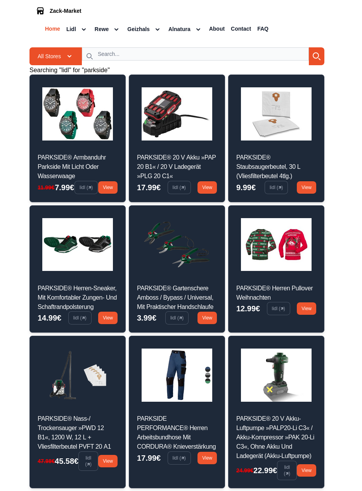
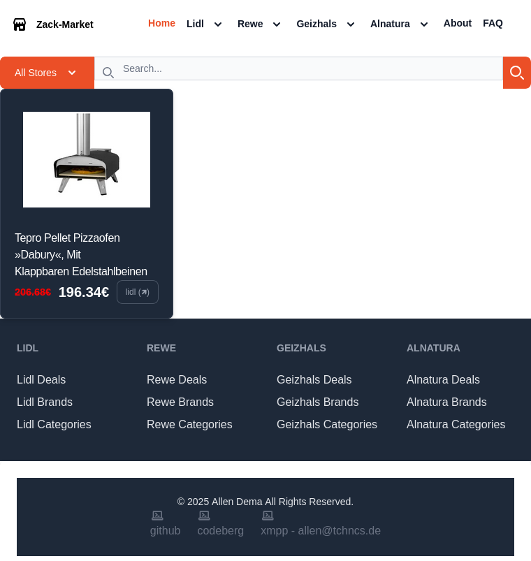

# Zack-Market

## FAQ
What?
  - Frontend for showing products, deals, brands, etc. of different markets/stores.

Why?
  - Playing with [Svelte](https://svelte.dev)
  - Finding better deals

How?
  - Consuming the OpenAPI of [zack-market-dl](https://github.com/allendema/zack-market-dl?tab=readme-ov-file#readme).


## Developing
This project uses [bun](https://bun.com) as package manager and runtime.  
Once you've installed dependencies with `bun install`, start the development server:

```bash
bun --bun run dev --open
```

To get all the respones from OpenAPI, setup the backend [zack-market-dl](https://github.com/allendema/zack-market-dl?tab=readme-ov-file#readme)

## Design Principles (For humans)
### Imports
Import from locals first. Empty Line and then external imports.

### Parsing
No or minimal parsing of backend results.

### Packages
Use minimal package dependencies.

### Look and Feel
Reuse same components or snippets everywhere.

### Git
[https://www.conventionalcommits.org/en/v1.0.0/#summary](https://www.conventionalcommits.org/en/v1.0.0/#summary)

## General Inspirations
Website: [https://www.mcmaster.com/](https://www.mcmaster.com/)  
Javascript: [https://sebhastian.com/](https://sebhastian.com/)  
Svelte Concepts:
  - [https://joyofcode.xyz/how-to-share-state-in-svelte-5](https://joyofcode.xyz/how-to-share-state-in-svelte-5)  
  - [https://sveltebyexample.com/state/](https://sveltebyexample.com/state/)  

## TODOs
- Minimal Caching [https://github.com/sveltejs/kit/issues/3642#issuecomment-1031640046](https://github.com/sveltejs/kit/issues/3642#issuecomment-1031640046)  
- Make Linting/Formatting possible when using Eslint and Prettier  
- Fix ProductCard height/width in some routes: http://localhost:5173/alnatura/brand/alnatura  
- 404 Page [https://www.404s.design/](https://www.404s.design/)  

## Examples
>Search example：
[](./docs/static/search.png "Search example")
>Product example：
[](./docs/static/product.png "Product example")

## License
[GNU General Public License 3](./LICENSE "GNU General Public License 3")
